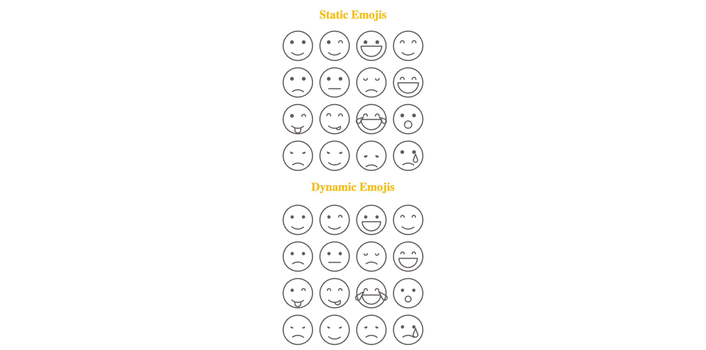

# Canvas Emoji Grid

This project features a dynamic grid of emoji expressions rendered on an HTML5 canvas. The canvas grid displays a variety of emoji expressions, creating a visually engaging and customizable canvas-based emoji experience.

## Features

- **Canvas-based Rendering:** Leverages the HTML5 canvas element for emoji grid display.
- **Varied Expressions:** Each cell in the grid displays a unique emoji, showcasing different expressions.
- **Customizable Layout:** Easily modify the grid dimensions or emoji selection to suit your preferences.

## Getting Started

## Visuals



### Prerequisites

To view or modify this project, you need:

- Basic knowledge of HTML5 Canvas
- A modern web browser

### Installation

1. Clone the repository:

   ```bash
   git clone https://github.com/BhoomiGohil/Emoji-Canvas.git
   ```

2. Open the `index.html` file in your browser to view the grid.

## Usage

- Modify the JavaScript file to change the grid dimensions, emoji types, or canvas colors.
- Customize the layout and expressions by updating the array of emojis in the code.

## Example

The emoji grid creates a fun and expressive interface, perfect for playful web projects or digital art!
